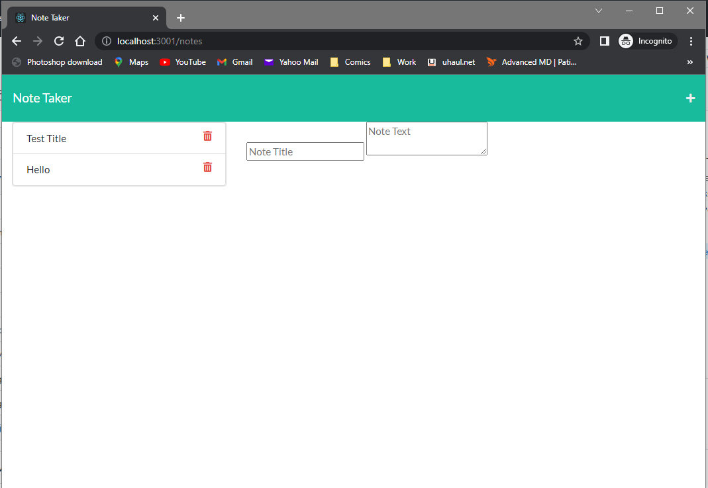

# 11-Challenge-note-taker

## Table of Contents
  - [Description](#Description)
  - [Use](#use)
  - [Contributers](#Contributers)
  - [Questions/Contact Me](#Questions)

## Description
A simple application that can be sued to write and save notes.  This application uses Express.js to store the notes in a json file and uses routes to allow the backend to communicate with the front end.

## Use
  Use app out of Heroku

## Contributers
[Tracy Rose Guajardo](https://github.com/tracyroseguajardo) 
[Lea Bryant](https://github.com/LeaBryant)

## Questions
[GitHub](https://github.com/krsparks2)   
[Email](mailto:krsparks2@yahoo.com)
 
[Heroku App](https://drive.google.com/file/d/1tn3F8_aO9MC-l5dMQI8KR6PZMVxnM096/view)

## Screenshot
